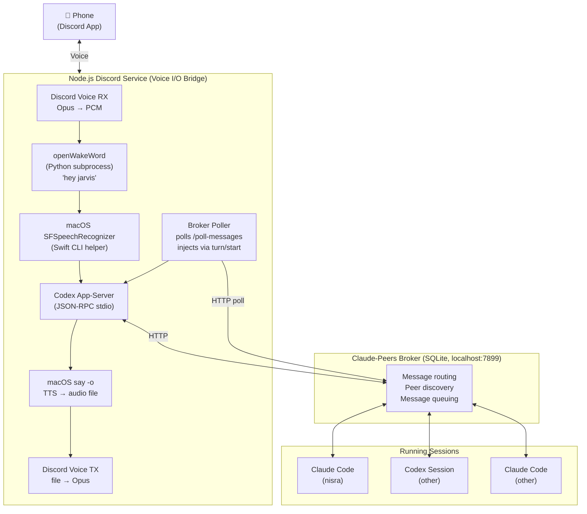
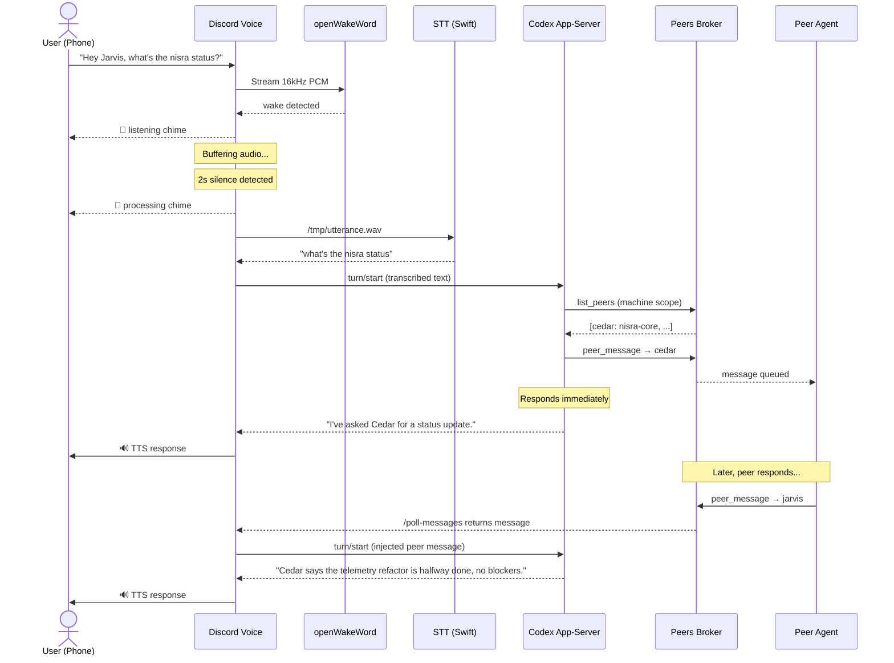
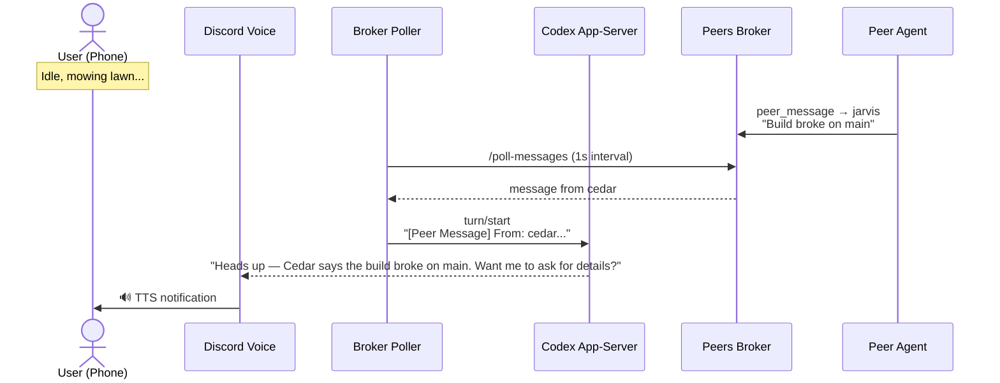
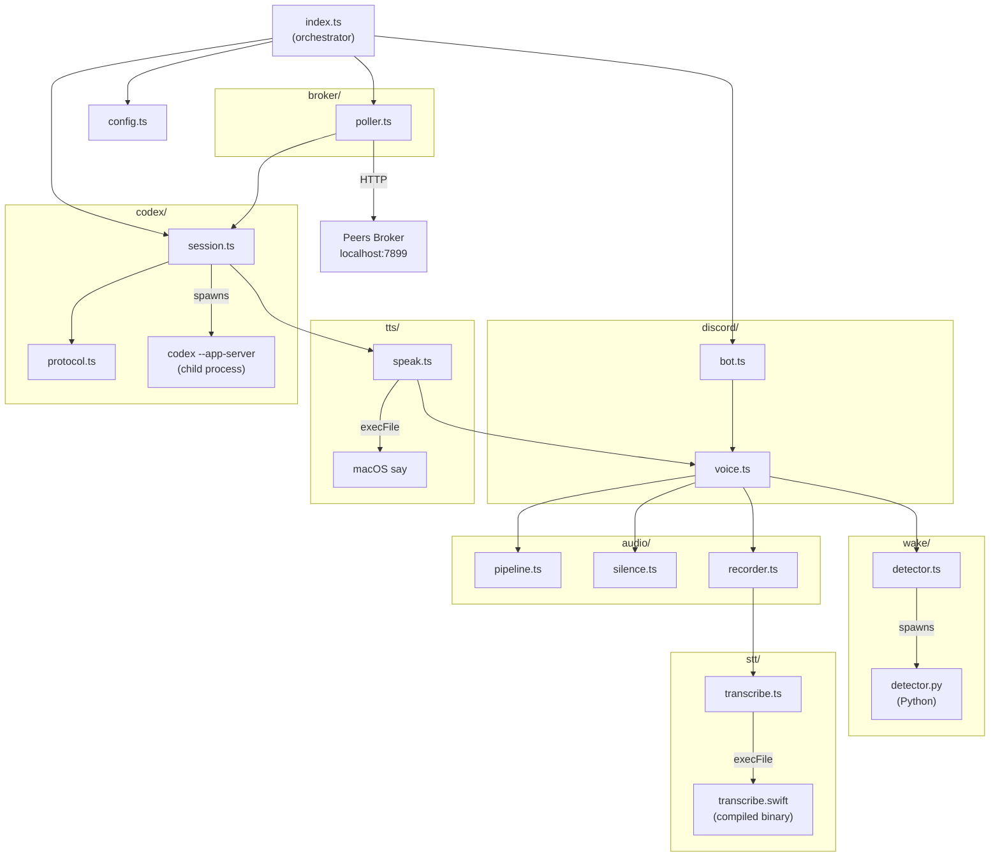

# Call Code — Voice Agent for Claude Code & Codex Sessions

## Overview

Call Code is a voice-activated Discord agent ("Jarvis") that lets you manage and communicate with Claude Code and Codex sessions running on your Mac — hands-free, from your phone. You join a Discord voice channel, say "Hey Jarvis, what's the status of the nisra agent?" and Jarvis transcribes your speech, processes it through a Codex app-server session, communicates with your running sessions via the claude-peers-mcp broker, and speaks the response back to you over Discord voice.

The goal: manage your development agents while mowing the lawn.

## Architecture

### System Overview



### Audio Pipeline

```mermaid
graph LR
    A["Discord Opus<br/>packets"] --> B["prism-media<br/>decode"]
    B --> C["48kHz PCM"]
    C --> D["Downsample"]
    D --> E["16kHz 16-bit<br/>mono PCM"]
    E --> F["openWakeWord<br/>(continuous)"]
    F -->|wake detected| G["🔔 Chime 1<br/>(listening)"]
    G --> H["Buffer audio"]
    H -->|2s silence| I["🔔 Chime 2<br/>(processing)"]
    I --> J["Write .wav"]
    J --> K["Swift STT"]
    K --> L["Transcribed text"]
```



### Voice Command Sequence



### Async Peer Notification Sequence



### Design Principles

- **Thin voice bridge**: The Node.js Discord service has zero intelligence. It handles audio I/O, wake word detection, STT/TTS, and shuttles text to/from the Codex brain. All decision-making lives in Codex.
- **macOS-native audio**: Uses built-in macOS speech recognition (SFSpeechRecognizer) and text-to-speech (`say`) — no cloud API keys for audio processing.
- **Codex as brain**: A Codex app-server session with peer-mcp tools handles all natural language understanding, intent routing, peer communication, and response generation. Adding capabilities means adding tools to Codex, not changing the Discord service.
- **Async-first peer communication**: Peer responses are injected into the Codex conversation as they arrive, not polled synchronously. The voice bridge polls the broker and relays messages into Codex via the app-server API.

## User Stories

### US-1: Voice Command to a Running Agent

**As** a developer away from my desk,
**I want** to ask Jarvis about the status of a specific running agent,
**so that** I can monitor progress without touching my computer.

**Flow:**
1. I join the Discord voice channel from my phone
2. I say: "Hey Jarvis, what is the status of the nisra agent?"
3. I hear a chime (wake word detected, listening)
4. I finish speaking, 2 seconds of silence pass
5. I hear a different chime (utterance captured, processing)
6. Jarvis processes the request via Codex:
   - Codex calls `list_peers` to find the nisra agent
   - Codex calls `peer_message` to ask nisra for a status update
7. The nisra agent responds through the broker
8. The broker poller picks up the response, injects it into Codex
9. Codex formulates a conversational summary
10. Jarvis speaks: "The nisra agent is working on the telemetry module. It's about halfway through refactoring the data pipeline and hasn't hit any blockers."

**Acceptance Criteria:**
- Wake word "Hey Jarvis" is detected reliably in Discord voice audio
- Utterance is captured from end of wake word to 2-second silence
- Codex receives the transcribed text and can call peer-mcp tools
- Peer responses are relayed back as speech within a reasonable time
- Two distinct chimes: listening and processing

---

### US-2: Conversational Follow-up

**As** a developer in an ongoing voice conversation,
**I want** to give follow-up commands that reference previous context,
**so that** I can have natural multi-turn conversations.

**Flow:**
1. Me: "Hey Jarvis, what's everyone working on?"
2. Jarvis: "You have three agents running. Cedar is working on nisra telemetry, Blaze is on the GSN frontend, and Apollo is running tests for the deploy pipeline."
3. Me: "Hey Jarvis, tell Cedar to prioritize the downlink module."
4. Jarvis: "Got it, I've sent that message to Cedar."
5. (30 seconds later, Cedar responds)
6. Jarvis: "Cedar says it'll shift focus to the downlink module after finishing the current file."

**Acceptance Criteria:**
- Codex maintains conversation context across turns within the same session
- Pronouns and references ("tell Cedar") resolve correctly via Codex context
- Async peer responses trigger Jarvis to speak unprompted

---

### US-3: Async Notification from a Peer

**As** a developer doing yard work,
**I want** to be notified when an agent completes a task or needs attention,
**so that** I can stay informed without actively asking.

**Flow:**
1. I'm in the voice channel but haven't said anything in 5 minutes
2. The nisra agent finishes its task and sends a message through the broker: "Completed telemetry refactor. 3 tests failing, need guidance on the expected output format."
3. The broker poller picks up the message
4. It's injected into the Codex session
5. Codex decides this is worth reporting immediately
6. Jarvis speaks: "Heads up — the nisra agent finished the telemetry refactor, but three tests are failing. It's asking about the expected output format. Want me to tell it to use the format from the existing tests?"

**Acceptance Criteria:**
- Broker poller detects messages addressed to the Codex peer
- Unsolicited peer messages are injected into Codex and trigger TTS output
- Codex adds judgment (urgency, actionability) rather than raw-relaying

---

### US-4: List and Discover Running Sessions

**As** a developer starting my day,
**I want** to ask what sessions are running,
**so that** I know what's active on my machine.

**Flow:**
1. Me: "Hey Jarvis, who's online?"
2. Jarvis: "Four sessions are running. Cedar is in nisra-core working on telemetry. Blaze is in gsn-frontend doing component refactoring. Apollo is idle in the deploy repo. And there's a Codex session in call-code — that's me."

**Acceptance Criteria:**
- Codex calls `list_peers` with machine scope
- Response is conversational, not a raw data dump
- Jarvis identifies itself in the list

---

### US-5: Startup and Shutdown

**As** a developer,
**I want** to start and stop the voice agent cleanly,
**so that** it doesn't consume resources when I'm not using it.

**Flow:**
1. I run `bun run start` from the call-code directory
2. The service starts: Codex app-server session, Discord bot login, openWakeWord subprocess, broker poller
3. Jarvis joins the configured voice channel
4. Jarvis speaks: "Jarvis online. I can see [N] active sessions."
5. When I'm done, I run `bun run stop` or Ctrl+C
6. Graceful shutdown: Codex session closed, Discord bot disconnects, subprocesses killed, peer unregistered

**Acceptance Criteria:**
- Single command to start the full stack
- Codex session registers as a peer on startup
- Graceful shutdown with no orphaned processes
- Startup greeting confirms connectivity

## Components

### 1. Discord Voice Bridge (`src/discord/`)

**Responsibility**: Connect to Discord, receive/send voice audio, manage the voice connection lifecycle.

**Technology**: `discord.js` v14 + `@discordjs/voice` + `@discordjs/opus` + `prism-media`

**Behavior:**
- Bot logs in with a token, joins a configured voice channel
- Subscribes to the user's audio stream (single-user, so we only listen to one member)
- Receives Opus packets, decodes to 48kHz PCM via prism-media
- Downsamples to 16kHz 16-bit mono PCM and pipes to the wake word detector
- When TTS audio is ready, creates an audio resource from the file and plays it through the voice connection
- Plays chime audio files on wake/processing events

**Configuration:**
```
DISCORD_BOT_TOKEN=...
DISCORD_GUILD_ID=...
DISCORD_VOICE_CHANNEL_ID=...
DISCORD_USER_ID=...           # only listen to this user
```

**Audio Pipeline:** See the [Audio Pipeline diagram](#audio-pipeline) in the Architecture section.

---

### 2. Wake Word Detector (`src/wake/`)

**Responsibility**: Continuously process audio and emit wake word detection events.

**Technology**: openWakeWord (Python), pre-trained "hey_jarvis" model

**Integration**: Runs as a long-lived Python subprocess. Node.js pipes 16kHz 16-bit mono PCM to its stdin. The subprocess writes JSON detection events to stdout.

**Python subprocess** (`src/wake/detector.py`):
```python
import openwakeword
import sys
import json

model = openwakeword.Model(wakeword_models=["hey_jarvis"])

while True:
    audio_chunk = sys.stdin.buffer.read(1280)  # 80ms at 16kHz 16-bit
    if not audio_chunk:
        break
    prediction = model.predict(audio_chunk)
    score = prediction["hey_jarvis"]
    if score > 0.5:
        sys.stdout.write(json.dumps({"event": "wake", "score": score}) + "\n")
        sys.stdout.flush()
```

**Node.js side**:
- Spawns `python3 src/wake/detector.py`
- Pipes downsampled PCM to subprocess stdin
- Reads JSON lines from stdout
- On `{"event": "wake"}`: emits `wake` event, plays listening chime, starts audio buffering

---

### 3. Utterance Capture & Silence Detection (`src/audio/`)

**Responsibility**: After wake word, buffer audio and detect when the user stops speaking.

**Behavior:**
- Activated by wake word detection
- Buffers all incoming 16kHz PCM audio
- Monitors audio energy (RMS) to detect silence
- After 2 seconds of continuous silence (energy below threshold): stops buffering
- Writes buffered audio to a temporary `.wav` file
- Emits `utterance-ready` event with the file path
- Plays the processing chime

**Silence Detection**:
- Compute RMS energy per 80ms frame
- Silence threshold: configurable, default empirically tuned
- Silence duration: 2 seconds (configurable)
- Maximum utterance length: 30 seconds (safety cap)

---

### 4. Speech-to-Text — macOS SFSpeechRecognizer (`src/stt/`)

**Responsibility**: Transcribe a captured audio file to text.

**Technology**: Swift CLI helper using Apple's `SFSpeechRecognizer` framework (on-device, free, private).

**Swift helper** (`src/stt/transcribe.swift`):
- Takes a file path as argument
- Uses `SFSpeechURLRecognitionRequest` for file-based recognition
- Prints transcribed text to stdout
- Exits with code 0 on success, 1 on failure

**Compiled binary**: `src/stt/transcribe` (built once via `swiftc`)

**Node.js integration**:
```
execFile('./src/stt/transcribe', ['/tmp/utterance.wav']) → stdout = transcribed text
```

**Requirements**:
- macOS 10.15+ (Catalina or later)
- Speech recognition permission granted (prompted on first use)
- On-device model (no network required after initial download)

---

### 5. Text-to-Speech — macOS `say` (`src/tts/`)

**Responsibility**: Convert text responses to audio files for Discord playback.

**Technology**: macOS `say` command

**Behavior**:
```bash
say -v Daniel -o /tmp/jarvis-response.aiff "Response text here"
```

- Voice: `Daniel` (en_GB) — clear British English, good "assistant" tone
- Output: AIFF file (native format for `say`, lossless)
- The Discord voice bridge reads this file and streams it into the voice connection

**Node.js integration**:
```
execFile('say', ['-v', 'Daniel', '-o', tempFile, text]) → tempFile ready for playback
```

**Considerations**:
- Long responses should be chunked at sentence boundaries for faster time-to-first-audio
- Maximum TTS input: ~500 characters per chunk (keeps generation fast)
- System prompt instructs Codex to keep responses concise and conversational

---

### 6. Codex App-Server Session (`src/codex/`)

**Responsibility**: The brain. Processes all user commands, makes decisions, calls peer-mcp tools, generates responses.

**Technology**: Codex CLI app-server, JSON-RPC 2.0 over stdio

**Lifecycle**:
1. On startup, spawn: `codex app-server` (subcommand, not flag)
2. Send `initialize` with client info
3. Send `thread/start` with `baseInstructions`, `cwd`, `model`, and `approvalPolicy: "never"`
4. For each user utterance: send `turn/start` with the transcribed text
5. Listen for `item/agentMessage/delta` notifications to stream the response
6. On `turn/completed`: full response ready, send to TTS
7. For async peer messages: send `turn/start` with injected context

**JSON-RPC Messages**:

Initialize:
```json
{
  "jsonrpc": "2.0",
  "method": "initialize",
  "id": 0,
  "params": {
    "clientInfo": { "name": "call-code", "version": "0.1.0" },
    "capabilities": {}
  }
}
```

Start a thread:
```json
{
  "jsonrpc": "2.0",
  "method": "thread/start",
  "id": 1,
  "params": { "model": "gpt-5.4" }
}
```

Send user input:
```json
{
  "jsonrpc": "2.0",
  "method": "turn/start",
  "id": 2,
  "params": {
    "threadId": "thr_...",
    "input": [{ "type": "text", "text": "What is the status of the nisra agent?" }]
  }
}
```

**System Prompt** (provided via `baseInstructions` in `thread/start`):
```
You are Jarvis, a voice assistant managing development sessions on Jason's Mac.
You communicate through speech — keep all responses conversational, concise, and
under 2-3 sentences unless asked for detail. Never output tables, code blocks,
markdown, or structured data — everything you say will be spoken aloud via TTS.

You have access to the claude-peers-mcp tools to discover and communicate with
running Claude Code and Codex sessions. Use list_peers to find sessions, 
peer_message to communicate, and check_messages to poll for responses.

When relaying peer messages, summarize rather than quoting verbatim. Add your own
judgment — if something seems urgent, say so. If a peer asks a question, offer to
help answer it.

When you receive an injected peer message, assess whether it's worth interrupting 
the user. Routine status updates can wait; errors, failures, and questions should
be reported immediately.
```

**Approval Handling**:
- `approvalPolicy: "never"` set in `thread/start` — Codex won't request approval
- As a fallback, any `requestApproval` notifications are auto-accepted with `acceptForSession`
- Jarvis is fully autonomous — no confirmation prompts, no vocal approval requests

---

### 7. Broker Poller (`src/broker/`)

**Responsibility**: Poll the claude-peers broker for messages addressed to the Codex session and inject them into the Codex conversation.

**Behavior**:
1. On startup, wait for the Codex session to register as a peer
2. Discover the Codex peer ID by:
   - Watching `/tmp/claude-peers/` for a new registration file matching the Codex PID
   - Or querying `GET /list-peers` on the broker and matching by PID
3. Poll `POST /poll-messages` every 1 second with the Codex peer ID
4. When messages arrive, format them with context and inject into Codex:
   ```
   [Peer Message] From: cedar (Claude Code, working on nisra telemetry in ~/dev/nisra-core)
   Message: "Completed the refactor. Three tests are failing — need guidance on expected output format."
   ```
5. This triggers a new Codex turn, whose response flows through TTS to the user

**Broker HTTP API** (localhost:7899):
```
POST /poll-messages { "peer_id": "jarvis" }
→ { "messages": [{ "from_id": "cedar", "text": "...", "sent_at": "..." }] }
```

**Edge Cases**:
- If multiple messages arrive at once, batch them into a single Codex injection
- If the broker is unreachable, log a warning and retry (don't crash)
- If the Codex session hasn't registered yet, wait and retry

---

### 8. Audio Assets (`assets/`)

**Chime sounds**:
- `assets/chime-wake.wav` — played when wake word is detected (listening). Short, bright, ascending tone.
- `assets/chime-processing.wav` — played when silence is detected and processing begins. Short, deeper, confirming tone.

Both should be short (<0.5s) and distinct.

## Data Flow

See the [Voice Command Sequence](#voice-command-sequence) and [Async Peer Notification Sequence](#async-peer-notification-sequence) diagrams in the Architecture section for detailed step-by-step flows.

## Project Structure

```
call-code/
├── package.json
├── tsconfig.json
├── CLAUDE.md
├── assets/
│   ├── chime-wake.wav
│   └── chime-processing.wav
├── src/
│   ├── index.ts              # entry point, orchestrates all components
│   ├── config.ts             # env vars, constants
│   ├── discord/
│   │   ├── bot.ts            # Discord client, login, guild/channel management
│   │   └── voice.ts          # voice connection, audio receive/send pipeline
│   ├── wake/
│   │   ├── detector.ts       # Node.js wrapper for openWakeWord subprocess
│   │   └── detector.py       # Python wake word detection subprocess
│   ├── audio/
│   │   ├── pipeline.ts       # audio downsampling, PCM processing
│   │   ├── silence.ts        # silence detection / utterance boundary
│   │   └── recorder.ts       # buffer management, WAV file writing
│   ├── stt/
│   │   ├── transcribe.swift  # Swift CLI for SFSpeechRecognizer
│   │   └── transcribe.ts     # Node.js wrapper for Swift helper
│   ├── tts/
│   │   └── speak.ts          # macOS say wrapper, audio file generation
│   ├── codex/
│   │   ├── session.ts        # Codex app-server lifecycle, JSON-RPC client
│   │   └── protocol.ts       # JSON-RPC message types and helpers
│   └── broker/
│       └── poller.ts         # broker HTTP polling, message injection
└── scripts/
    ├── build-stt.sh          # compile Swift transcribe helper
    └── setup.sh              # install Python deps, download wake word model
```

### Component Dependencies



## Configuration

All configuration via environment variables (`.env` file):

```bash
# Discord
DISCORD_BOT_TOKEN=              # bot token from Discord Developer Portal
DISCORD_GUILD_ID=               # private server ID
DISCORD_VOICE_CHANNEL_ID=       # voice channel to join
DISCORD_USER_ID=                # only listen to this user's audio

# Codex
CODEX_MODEL=gpt-5.4             # model for the Codex session
CODEX_CWD=/Users/jason/dev      # working directory for Codex session

# Peers Broker
PEERS_BROKER_URL=http://localhost:7899
PEERS_POLL_INTERVAL_MS=1000     # how often to poll for peer messages

# Audio
WAKE_WORD_THRESHOLD=0.5         # openWakeWord confidence threshold
SILENCE_THRESHOLD_RMS=500       # RMS energy below this = silence
SILENCE_DURATION_MS=2000        # silence duration to end utterance
MAX_UTTERANCE_MS=30000          # max recording length

# TTS
TTS_VOICE=Daniel                # macOS say voice
```

## Error Handling

| Scenario | Behavior |
|---|---|
| Discord disconnects | Attempt reconnect with exponential backoff. Log warning. |
| openWakeWord subprocess crashes | Restart it. Log error. No audio processing during restart. |
| STT fails (Swift helper error) | Speak "Sorry, I didn't catch that. Could you repeat?" |
| Codex app-server crashes | Restart session, create new thread. Speak "I had to restart, but I'm back." |
| Broker unreachable | Poller retries silently. Codex peer-mcp calls return errors that Codex handles conversationally ("I can't reach the other agents right now.") |
| Peer doesn't respond | Codex handles this with its own judgment. May say "Cedar hasn't responded yet, I'll let you know when it does." |
| TTS fails | Log error. Silently skip (user won't hear anything — logged for debugging). |
| Audio too short (<0.5s after wake) | Discard, don't process. Probably a false positive. |
| Audio too long (>30s) | Truncate at 30s, transcribe what we have. |

## Dependencies

### Node.js (Bun)
- `discord.js` — Discord bot framework
- `@discordjs/voice` — voice connection management
- `@discordjs/opus` — Opus encoding/decoding
- `prism-media` — audio format conversion
- `sodium-native` or `tweetnacl` — encryption for Discord voice

### Python
- `openwakeword` — wake word detection
- `onnxruntime` — ML inference runtime (dependency of openwakeword)

### System
- macOS 13+ (Ventura) — for SFSpeechRecognizer on-device models
- Swift 6.x — compile the STT helper
- `ffmpeg` — audio format conversion if needed for Discord playback
- Python 3.9+ — for openWakeWord

## Setup Steps

1. **Discord Bot**: Create application at discord.com/developers, add bot, enable voice intents, invite to private server with voice permissions
2. **Python environment**: `python3 -m venv .venv && source .venv/bin/activate && pip install openwakeword`
3. **Swift STT helper**: `./scripts/build-stt.sh` (compiles transcribe.swift)
4. **Node dependencies**: `bun install`
5. **Environment**: Copy `.env.example` to `.env`, fill in Discord credentials
6. **macOS permissions**: Grant Speech Recognition and Microphone permissions when prompted on first run
7. **Start**: `bun run start`

## Future Considerations (v2+)

- **Session launching**: "Hey Jarvis, start a new Claude Code session in nisra-core and have it fix the linting errors" — spawn `claude` or `codex` processes from the agent
- **Multi-user voice**: Support multiple people in the voice channel, with per-user audio separation and speaker identification
- **Custom wake word**: Train a custom openWakeWord model for a unique trigger phrase
- **Streaming STT**: Use SFSpeechRecognizer's streaming mode for real-time transcription, showing partial results and reducing latency
- **Streaming TTS**: Start speaking before the full response is generated by chunking at sentence boundaries
- **Voice cloning**: Use ElevenLabs or similar for a custom Jarvis voice instead of macOS Daniel
- **Non-Discord transports**: WebRTC direct connection, Twilio phone call, or FaceTime integration
- **Proactive agent**: Jarvis monitors all peers and proactively reports when things go wrong, without being asked
- **Task delegation**: "Hey Jarvis, create a new task to refactor the telemetry parser" — integrate with OpenProject or other task management
