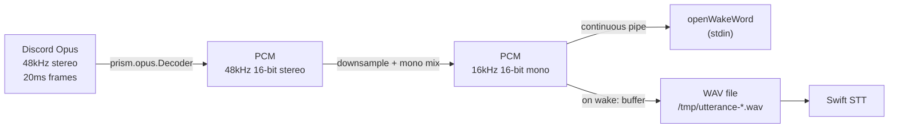
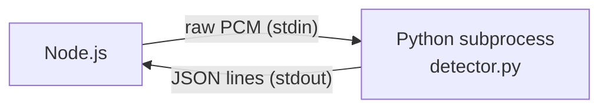
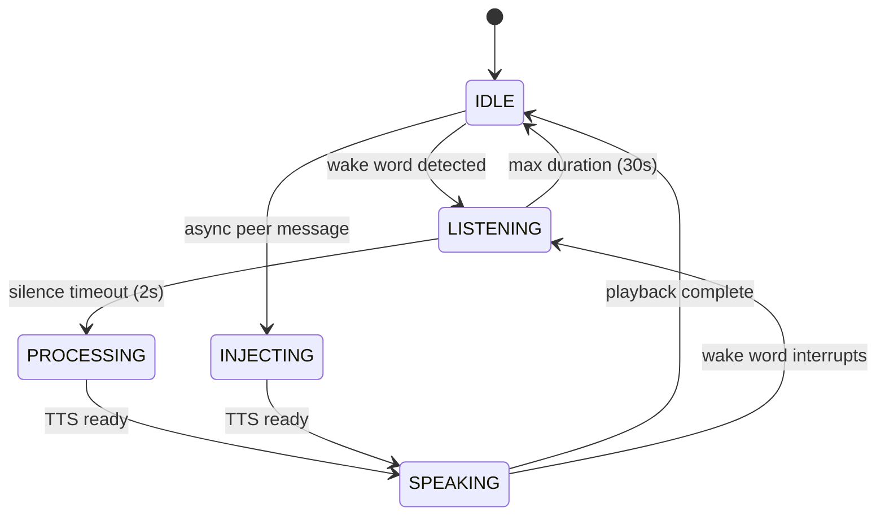
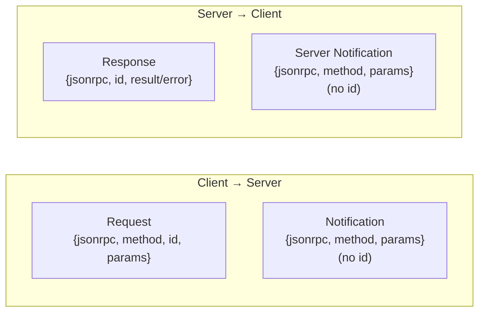
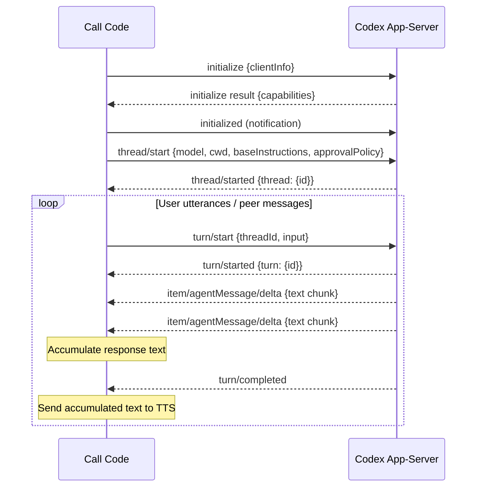
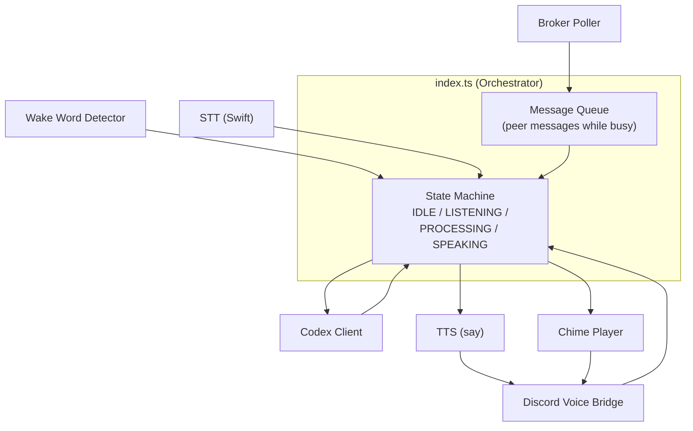
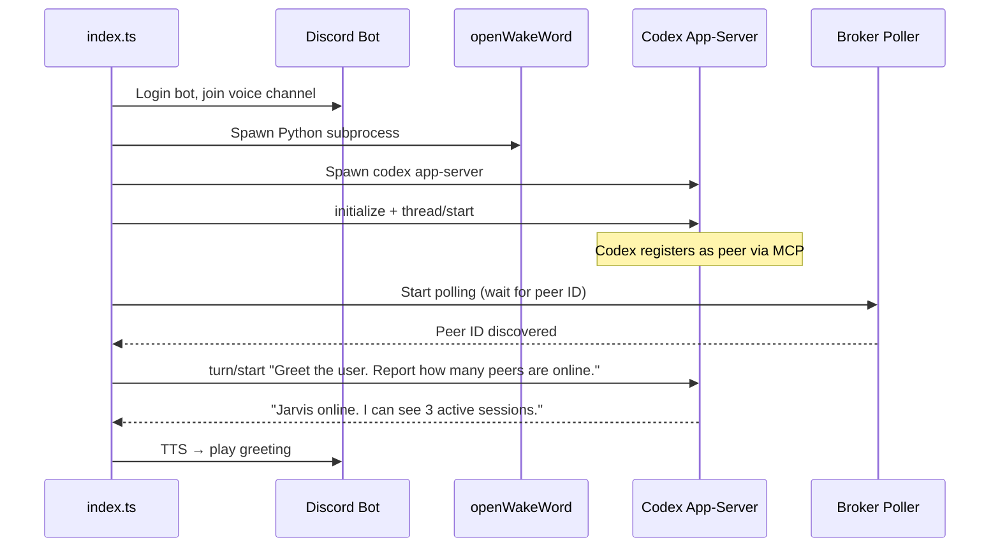

# Call Code — Technical Plan

## Runtime & Tooling

| Choice | Value | Rationale |
|--------|-------|-----------|
| Runtime | Node.js (LTS) | Native addon reliability for Discord voice (Opus, sodium) |
| Package manager | pnpm | User preference |
| Language | TypeScript 6.x | Strict mode, ES2023 target |
| TS runner | tsx 4.x | For development; tsc for production build |
| Module system | ESM (`"type": "module"`) | Modern, tree-shakeable |

## Dependencies

### Production

| Package | Version | Purpose |
|---------|---------|---------|
| `discord.js` | ^14.26.3 | Discord bot framework |
| `@discordjs/voice` | ^0.19.2 | Voice connection, audio send/receive |
| `@discordjs/opus` | ^0.10.0 | Native Opus codec for voice |
| `sodium-native` | ^5.1.0 | Native libsodium for voice encryption |
| `prism-media` | ^1.3.5 | Audio stream transforms (Opus decode/encode) |
| `ffmpeg-static` | ^5.3.0 | Audio format conversion for playback |
| `dotenv` | ^17.4.2 | Environment variable loading |

### Development

| Package | Version | Purpose |
|---------|---------|---------|
| `typescript` | ^6.0.3 | Type checking and compilation |
| `tsx` | ^4.21.0 | TypeScript execution for development |
| `@types/node` | ^25.6.0 | Node.js type definitions |

### System (non-npm)

| Dependency | Version | Purpose |
|------------|---------|---------|
| Python | 3.9+ | openWakeWord runtime |
| `openwakeword` | latest (pip) | Wake word detection |
| `onnxruntime` | latest (pip, transitive) | ML inference for wake word |
| Swift | 6.x (Xcode) | Compile SFSpeechRecognizer CLI helper |
| macOS | 13+ (Ventura) | SFSpeechRecognizer on-device models |
| ffmpeg | via ffmpeg-static | Audio conversion (bundled, no system install needed) |

## Component Technical Details

### 1. Discord Voice Bridge

#### Connection Setup

```typescript
import { Client, GatewayIntentBits } from "discord.js";
import {
  joinVoiceChannel,
  EndBehaviorType,
  VoiceConnectionStatus,
  entersState,
} from "@discordjs/voice";

const client = new Client({
  intents: [
    GatewayIntentBits.Guilds,
    GatewayIntentBits.GuildVoiceStates,
  ],
});

const connection = joinVoiceChannel({
  channelId: VOICE_CHANNEL_ID,
  guildId: GUILD_ID,
  adapterCreator: guild.voiceAdapterCreator,
  selfDeaf: false,  // REQUIRED for receiving audio
  selfMute: true,
});

await entersState(connection, VoiceConnectionStatus.Ready, 20_000);
```

#### Receiving Audio

```typescript
import * as prism from "prism-media";

// Subscribe to the target user's audio stream
const opusStream = connection.receiver.subscribe(TARGET_USER_ID, {
  end: { behavior: EndBehaviorType.Manual },
});

// Decode Opus → 48kHz 16-bit stereo PCM
const pcmStream = opusStream.pipe(
  new prism.opus.Decoder({ rate: 48_000, channels: 2, frameSize: 960 })
);
```

#### Audio Format Chain



#### Sending Audio (TTS Playback)

```typescript
import { createAudioResource, createAudioPlayer, AudioPlayerStatus } from "@discordjs/voice";

const resource = createAudioResource("/tmp/jarvis-response.aiff");
const player = createAudioPlayer();
connection.subscribe(player);
player.play(resource);

await entersState(player, AudioPlayerStatus.Idle, 30_000);
```

`createAudioResource` uses ffmpeg (via `ffmpeg-static`) internally to decode AIFF to Opus for Discord.

#### Speaking Detection

```typescript
connection.receiver.speaking.on("start", (userId) => {
  if (userId !== TARGET_USER_ID) return;
  // User started speaking — useful for interrupting TTS playback
});
```

---

### 2. Audio Downsampling

Discord outputs 48kHz stereo PCM. openWakeWord needs 16kHz mono.

**Approach**: Simple integer decimation (3:1) with stereo-to-mono mix. No library needed.

```typescript
function downsample48kStereoTo16kMono(input: Buffer): Buffer {
  const samples = input.length / 4; // 2 bytes per sample, 2 channels
  const outputSamples = Math.floor(samples / 3);
  const output = Buffer.alloc(outputSamples * 2); // 16-bit mono

  for (let i = 0; i < outputSamples; i++) {
    const srcOffset = i * 3 * 4; // every 3rd stereo sample pair
    const left = input.readInt16LE(srcOffset);
    const right = input.readInt16LE(srcOffset + 2);
    const mono = Math.round((left + right) / 2);
    output.writeInt16LE(mono, i * 2);
  }

  return output;
}
```

**Why no low-pass filter**: Speech is bandlimited to ~4kHz. At 16kHz sample rate, Nyquist is 8kHz. Discord voice already low-passes at the codec level. Aliasing artifacts are negligible for wake word detection and STT.

---

### 3. openWakeWord Subprocess

**Protocol**: stdin receives raw 16kHz 16-bit mono PCM. stdout emits newline-delimited JSON events.



**Python subprocess** (`src/wake/detector.py`):

```python
import openwakeword
import sys
import json

model = openwakeword.Model(wakeword_models=["hey_jarvis"])

CHUNK_SIZE = 1280  # 80ms at 16kHz, 16-bit = 1280 bytes

while True:
    chunk = sys.stdin.buffer.read(CHUNK_SIZE)
    if len(chunk) < CHUNK_SIZE:
        break
    prediction = model.predict(chunk)
    score = prediction["hey_jarvis"]
    if score > 0.5:
        event = json.dumps({"event": "wake", "score": round(score, 3)})
        sys.stdout.write(event + "\n")
        sys.stdout.flush()
```

**Node.js wrapper** (`src/wake/detector.ts`):

```typescript
import { spawn, ChildProcess } from "node:child_process";
import { EventEmitter } from "node:events";
import * as readline from "node:readline";

class WakeWordDetector extends EventEmitter {
  private proc: ChildProcess;

  constructor(pythonPath: string, scriptPath: string, threshold = 0.5) {
    super();
    this.proc = spawn(pythonPath, [scriptPath], {
      stdio: ["pipe", "pipe", "inherit"],
    });

    const rl = readline.createInterface({ input: this.proc.stdout! });
    rl.on("line", (line) => {
      const event = JSON.parse(line);
      if (event.event === "wake" && event.score >= threshold) {
        this.emit("wake", event.score);
      }
    });

    this.proc.on("exit", (code) => this.emit("exit", code));
  }

  feed(pcm16kMono: Buffer): void {
    this.proc.stdin!.write(pcm16kMono);
  }

  destroy(): void {
    this.proc.kill("SIGTERM");
  }
}
```

---

### 4. Silence Detection & Utterance Capture

**State machine**: Managed by the audio pipeline coordinator.



**Silence detection algorithm**:

```typescript
const SILENCE_THRESHOLD_RMS = 500;
const SILENCE_DURATION_MS = 2000;
const FRAME_DURATION_MS = 80;

function computeRMS(pcm16bit: Buffer): number {
  let sumSquares = 0;
  const sampleCount = pcm16bit.length / 2;
  for (let i = 0; i < sampleCount; i++) {
    const sample = pcm16bit.readInt16LE(i * 2);
    sumSquares += sample * sample;
  }
  return Math.sqrt(sumSquares / sampleCount);
}
```

Silence is detected when RMS stays below threshold for `SILENCE_DURATION_MS / FRAME_DURATION_MS` consecutive frames (25 frames at 80ms each).

**WAV file writing** (44-byte header + raw PCM):

```typescript
function writeWav(pcm: Buffer, sampleRate: number, filePath: string): void {
  const header = Buffer.alloc(44);
  const dataSize = pcm.length;
  const fileSize = 36 + dataSize;

  header.write("RIFF", 0);
  header.writeUInt32LE(fileSize, 4);
  header.write("WAVE", 8);
  header.write("fmt ", 12);
  header.writeUInt32LE(16, 16);      // fmt chunk size
  header.writeUInt16LE(1, 20);       // PCM format
  header.writeUInt16LE(1, 22);       // mono
  header.writeUInt32LE(sampleRate, 24);
  header.writeUInt32LE(sampleRate * 2, 28); // byte rate
  header.writeUInt16LE(2, 32);       // block align
  header.writeUInt16LE(16, 34);      // bits per sample
  header.write("data", 36);
  header.writeUInt32LE(dataSize, 40);

  writeFileSync(filePath, Buffer.concat([header, pcm]));
}
```

---

### 5. Speech-to-Text (Swift CLI Helper)

**Swift source** (`src/stt/transcribe.swift`):

```swift
import Foundation
import Speech

guard CommandLine.arguments.count > 1 else {
    fputs("Usage: transcribe <audio-file-path>\n", stderr)
    exit(1)
}

let url = URL(fileURLWithPath: CommandLine.arguments[1])

guard let recognizer = SFSpeechRecognizer(locale: Locale(identifier: "en-US")) else {
    fputs("Speech recognizer unavailable\n", stderr)
    exit(1)
}

let request = SFSpeechURLRecognitionRequest(url: url)
request.requiresOnDeviceRecognition = true

let semaphore = DispatchSemaphore(value: 0)
var resultText = ""
var errorOccurred = false

recognizer.recognitionTask(with: request) { result, error in
    if let error = error {
        fputs("Error: \(error.localizedDescription)\n", stderr)
        errorOccurred = true
        semaphore.signal()
        return
    }
    if let result = result, result.isFinal {
        resultText = result.bestTranscription.formattedString
        semaphore.signal()
    }
}

semaphore.wait()

if errorOccurred {
    exit(1)
}

print(resultText)
```

**Build script** (`scripts/build-stt.sh`):

```bash
#!/bin/bash
set -euo pipefail

SCRIPT_DIR="$(cd "$(dirname "$0")" && pwd)"
SRC="$SCRIPT_DIR/../src/stt/transcribe.swift"
OUT="$SCRIPT_DIR/../src/stt/transcribe"

swiftc "$SRC" -o "$OUT" -framework Speech -framework Foundation
echo "Built: $OUT"
```

**Node.js wrapper** (`src/stt/transcribe.ts`):

```typescript
import { execFile } from "node:child_process";
import { promisify } from "node:util";
import { join } from "node:path";

const execFileAsync = promisify(execFile);
const BINARY = join(import.meta.dirname, "transcribe");

export async function transcribe(audioFilePath: string): Promise<string> {
  const { stdout } = await execFileAsync(BINARY, [audioFilePath], {
    timeout: 15_000,
  });
  return stdout.trim();
}
```

---

### 6. Text-to-Speech (macOS `say`)

```typescript
import { execFile } from "node:child_process";
import { promisify } from "node:util";
import { join } from "node:path";
import { tmpdir } from "node:os";

const execFileAsync = promisify(execFile);

export async function speak(text: string, voice = "Daniel"): Promise<string> {
  const outPath = join(tmpdir(), `jarvis-${Date.now()}.aiff`);
  await execFileAsync("say", ["-v", voice, "-o", outPath, text], {
    timeout: 10_000,
  });
  return outPath;
}
```

For long responses, chunk at sentence boundaries before calling `say`:

```typescript
function chunkBySentence(text: string, maxLen = 500): string[] {
  const sentences = text.match(/[^.!?]+[.!?]+/g) || [text];
  const chunks: string[] = [];
  let current = "";

  for (const sentence of sentences) {
    if (current.length + sentence.length > maxLen && current) {
      chunks.push(current.trim());
      current = "";
    }
    current += sentence;
  }
  if (current.trim()) chunks.push(current.trim());
  return chunks;
}
```

---

### 7. Codex App-Server (JSON-RPC Client)

#### Spawning

```typescript
import { spawn } from "node:child_process";

const codex = spawn("codex", ["app-server"], {
  stdio: ["pipe", "pipe", "inherit"],
  cwd: CODEX_CWD,
});
```

#### JSON-RPC 2.0 Protocol

All communication is newline-delimited JSON over stdio. Three message types:



#### Client Implementation

```typescript
import * as readline from "node:readline";

type JsonRpcId = number;

interface PendingRequest {
  resolve: (result: any) => void;
  reject: (error: any) => void;
}

class CodexClient extends EventEmitter {
  private nextId = 0;
  private pending = new Map<JsonRpcId, PendingRequest>();
  private rl: readline.Interface;

  constructor(private proc: ChildProcess) {
    super();
    this.rl = readline.createInterface({ input: proc.stdout! });
    this.rl.on("line", (line) => this.handleLine(line));
  }

  private handleLine(line: string): void {
    const msg = JSON.parse(line);

    if ("id" in msg && this.pending.has(msg.id)) {
      // Response to our request
      const { resolve, reject } = this.pending.get(msg.id)!;
      this.pending.delete(msg.id);
      if (msg.error) reject(msg.error);
      else resolve(msg.result);
    } else if ("method" in msg && !("id" in msg)) {
      // Server notification
      this.emit("notification", msg.method, msg.params);
    }
  }

  async request(method: string, params: Record<string, any> = {}): Promise<any> {
    const id = this.nextId++;
    const msg = JSON.stringify({ jsonrpc: "2.0", method, id, params });
    this.proc.stdin!.write(msg + "\n");

    return new Promise((resolve, reject) => {
      this.pending.set(id, { resolve, reject });
    });
  }

  notify(method: string, params: Record<string, any> = {}): void {
    const msg = JSON.stringify({ jsonrpc: "2.0", method, params });
    this.proc.stdin!.write(msg + "\n");
  }
}
```

#### Session Lifecycle



#### Initialization Sequence

```typescript
async function initCodexSession(client: CodexClient): Promise<string> {
  // 1. Initialize
  await client.request("initialize", {
    clientInfo: { name: "call-code", version: "0.1.0" },
    capabilities: {},
  });
  client.notify("initialized", {});

  // 2. Create thread
  const result = await client.request("thread/start", {
    model: CODEX_MODEL,
    cwd: CODEX_CWD,
    baseInstructions: JARVIS_SYSTEM_PROMPT,
    approvalPolicy: "never",
    sandbox: "danger-full-access",
  });

  return result.thread.id;
}
```

#### Handling Responses & Approvals

```typescript
let responseBuffer = "";

client.on("notification", (method, params) => {
  switch (method) {
    case "item/agentMessage/delta":
      responseBuffer += params.text;
      break;

    case "turn/completed":
      const response = responseBuffer;
      responseBuffer = "";
      // Send to TTS pipeline
      emitResponse(response);
      break;

    case "item/commandExecution/requestApproval":
    case "item/fileChange/requestApproval":
      // Auto-approve everything
      client.request("serverRequest/resolved", {
        requestId: params.requestId,
        resolution: "acceptForSession",
      });
      break;
  }
});
```

#### System Prompt

Passed via `baseInstructions` in `thread/start`:

```
You are Jarvis, a voice assistant managing development sessions on Jason's Mac.

CRITICAL OUTPUT RULES:
- Everything you say is spoken aloud via text-to-speech.
- Keep responses to 1-3 sentences unless the user asks for detail.
- Never output tables, code blocks, markdown, bullet lists, or structured data.
- Use natural spoken language. Say "about 80 percent" not "~80%".
- Spell out abbreviations that would sound odd via TTS.

CAPABILITIES:
- You have claude-peers-mcp tools: list_peers, peer_message, check_messages, set_summary, whoami.
- Use list_peers with machine scope to discover running Claude Code and Codex sessions.
- Use peer_message to communicate with specific peers by their ID.
- When asked about "everyone" or "all agents", call list_peers first.

PEER COMMUNICATION:
- When sending peer_message, be specific about what you need.
- After sending a message, tell the user you've sent it. Don't wait for a response inline.
- When you receive an injected peer message (prefixed with [Peer Message]), assess urgency:
  - Errors, failures, questions → report immediately.
  - Routine status updates → summarize briefly.
- Summarize peer messages in your own words rather than quoting verbatim.

PERSONALITY:
- Professional but warm. Brief and direct.
- Proactively offer next steps ("Want me to tell it to retry?").
- If you can't reach a peer or the broker is down, say so plainly.
```

---

### 8. Broker Poller

Polls the claude-peers broker for messages addressed to the Codex session's peer ID, then injects them into the Codex conversation.

#### Peer ID Discovery

The Codex session registers as a peer through its peer-mcp tools. On registration, it writes to `/tmp/claude-peers/{ppid}.json`:

```json
{
  "id": "cedar",
  "pid": 12345,
  "ppid": 12340,
  "cwd": "/Users/jason/dev",
  "git_root": null,
  "client_kind": "codex"
}
```

The poller discovers the peer ID by either:
1. Reading `/tmp/claude-peers/{codex_pid}.json` after Codex registers
2. Querying `POST /list-peers` and matching by PID

Since the Codex app-server is our child process, we know its PID. However, the peer-mcp server is a child of Codex (spawned as an MCP server), so the PID in the registration file is the MCP server's PID and the PPID is the Codex PID. We match by finding a peer whose registration file's `ppid` matches our Codex child PID.

#### Polling Loop

```typescript
class BrokerPoller {
  private peerId: string | null = null;
  private interval: NodeJS.Timeout | null = null;

  constructor(
    private brokerUrl: string,
    private codexPid: number,
    private onMessage: (formatted: string) => void,
  ) {}

  async start(): Promise<void> {
    // Wait for peer registration
    this.peerId = await this.discoverPeerId();

    this.interval = setInterval(() => this.poll(), POLL_INTERVAL_MS);
  }

  private async discoverPeerId(): Promise<string> {
    // Poll /list-peers until we find our Codex session
    while (true) {
      const peers = await fetch(`${this.brokerUrl}/list-peers`, {
        method: "POST",
        headers: { "Content-Type": "application/json" },
        body: JSON.stringify({ scope: "machine", cwd: ".", git_root: null }),
      }).then((r) => r.json());

      const ours = peers.find((p: any) => p.pid === this.codexPid);
      // The MCP server's PID won't match directly — check registration files
      // Fallback: find newest codex peer
      const codexPeer = peers.find((p: any) => p.client_kind === "codex");
      if (codexPeer) return codexPeer.id;

      await new Promise((r) => setTimeout(r, 1000));
    }
  }

  private async poll(): Promise<void> {
    if (!this.peerId) return;

    const result = await fetch(`${this.brokerUrl}/poll-messages`, {
      method: "POST",
      headers: { "Content-Type": "application/json" },
      body: JSON.stringify({ id: this.peerId }),
    }).then((r) => r.json());

    if (result.messages.length === 0) return;

    // Enrich with sender context
    const peers = await fetch(`${this.brokerUrl}/list-peers`, {
      method: "POST",
      headers: { "Content-Type": "application/json" },
      body: JSON.stringify({ scope: "machine", cwd: ".", git_root: null }),
    }).then((r) => r.json());

    const lines = result.messages.map((msg: any) => {
      const sender = peers.find((p: any) => p.id === msg.from_id);
      const ctx = sender
        ? `${sender.client_kind}, working on: ${sender.summary || "unknown"}, in ${sender.cwd}`
        : "unknown session";
      return `[Peer Message] From: ${msg.from_id} (${ctx})\nMessage: "${msg.text}"`;
    });

    this.onMessage(lines.join("\n\n"));
  }

  stop(): void {
    if (this.interval) clearInterval(this.interval);
  }
}
```

**Important**: When the poller calls `/poll-messages`, the broker marks those messages as delivered. This means the Codex session's own `check_messages` tool won't see them. This is intentional — the poller is the delivery mechanism, and it injects messages into Codex via `turn/start`.

However, this creates a conflict: the Codex session has `check_messages` as a tool, but calling it will return nothing (poller already consumed the messages). We should instruct Codex in the system prompt to not use `check_messages` — messages will be delivered to it automatically.

**Alternative**: Don't poll externally. Instead, rely on the Codex session's peer-mcp to handle message delivery. But since Codex doesn't support `claude/channel` push, the session would need to call `check_messages` proactively or periodically. This is unreliable — Codex only acts when given a turn. The external poller is more robust.

---

### 9. Orchestrator (`src/index.ts`)

The entry point wires all components together and manages the state machine.



#### Startup Sequence



#### Shutdown Sequence

On SIGINT/SIGTERM:

1. Stop broker poller
2. Send disconnect to Discord voice
3. Kill openWakeWord subprocess
4. Close Codex app-server stdin (graceful shutdown)
5. Wait up to 5s for children to exit, then SIGKILL
6. Exit process

---

### 10. Concurrency & Queueing

#### Message Queue

A simple FIFO queue for messages that arrive while the system is busy:

```typescript
class SpeechQueue {
  private queue: string[] = [];
  private speaking = false;

  enqueue(text: string): void {
    this.queue.push(text);
    this.drain();
  }

  private async drain(): Promise<void> {
    if (this.speaking) return;
    const next = this.queue.shift();
    if (!next) return;

    this.speaking = true;
    const audioFile = await speak(next);
    await playToDiscord(audioFile);
    this.speaking = false;
    this.drain();
  }
}
```

#### Concurrency Rules

| Scenario | Behavior |
|----------|----------|
| Wake word during IDLE | Transition to LISTENING |
| Wake word during SPEAKING | Stop playback, transition to LISTENING |
| Wake word during PROCESSING | Ignore (already handling a request) |
| Peer message during IDLE | Inject into Codex, speak response |
| Peer message during SPEAKING | Queue, deliver after playback |
| Peer message during PROCESSING | Queue, deliver after current response |
| Codex turn in-flight + new utterance | Queue utterance, deliver after turn completes |

---

## Project Structure

```
call-code/
├── package.json
├── pnpm-lock.yaml
├── tsconfig.json
├── .env                          # local config (gitignored)
├── .env.example                  # template
├── .gitignore
├── CLAUDE.md                     # project instructions for Claude Code
├── AGENTS.md                     # project instructions for Codex
├── SPEC.md                       # feature spec
├── TECHNICAL_PLAN.md             # this document
├── assets/
│   ├── chime-wake.wav
│   └── chime-processing.wav
├── src/
│   ├── index.ts                  # orchestrator, state machine, startup/shutdown
│   ├── config.ts                 # env loading, constants, validation
│   ├── discord/
│   │   ├── bot.ts                # Client setup, login, guild resolution
│   │   └── voice.ts              # voice connection, audio rx/tx, chime playback
│   ├── wake/
│   │   ├── detector.ts           # spawns Python, pipes PCM, emits wake events
│   │   └── detector.py           # openWakeWord stdin/stdout subprocess
│   ├── audio/
│   │   ├── downsample.ts         # 48kHz stereo → 16kHz mono conversion
│   │   ├── silence.ts            # RMS-based silence detection
│   │   └── wav.ts                # WAV header writing
│   ├── stt/
│   │   ├── transcribe.swift      # SFSpeechRecognizer CLI
│   │   └── transcribe.ts         # Node wrapper, execFile
│   ├── tts/
│   │   └── speak.ts              # macOS say wrapper, sentence chunking
│   ├── codex/
│   │   ├── client.ts             # JSON-RPC 2.0 client, request/notification handling
│   │   └── session.ts            # Codex lifecycle, init, thread/start, turn management
│   └── broker/
│       └── poller.ts             # broker HTTP polling, peer ID discovery, message injection
├── scripts/
│   ├── build-stt.sh              # swiftc compile step
│   └── setup.sh                  # python venv, pip install, model download
└── python/
    ├── requirements.txt          # openwakeword, onnxruntime
    └── venv/                     # gitignored
```

---

## Build & Run

### Setup (one-time)

```bash
# Node dependencies
pnpm install

# Python environment
python3 -m venv python/venv
source python/venv/bin/activate
pip install -r python/requirements.txt

# Swift STT binary
./scripts/build-stt.sh

# Environment
cp .env.example .env
# Fill in DISCORD_BOT_TOKEN, DISCORD_GUILD_ID, etc.
```

### Development

```bash
pnpm dev          # tsx --watch src/index.ts
```

### Production

```bash
pnpm build        # tsc
pnpm start        # node dist/index.js
```

### package.json Scripts

```json
{
  "name": "call-code",
  "version": "0.1.0",
  "type": "module",
  "scripts": {
    "dev": "tsx --watch src/index.ts",
    "build": "tsc",
    "start": "node dist/index.js",
    "setup": "./scripts/setup.sh",
    "build:stt": "./scripts/build-stt.sh",
    "typecheck": "tsc --noEmit"
  }
}
```

---

## Implementation Order

Build and test each component in isolation before wiring them together.

### Phase 1: Foundation
1. **Project scaffold** — `pnpm init`, tsconfig, .env, .gitignore
2. **Config module** — load and validate environment variables
3. **Codex client** — JSON-RPC client, initialize, thread/start, turn/start, notification handling. Test with a simple text prompt.

### Phase 2: Audio Pipeline
4. **Discord bot** — login, join voice channel, verify connection
5. **Discord voice receive** — subscribe to user audio, decode Opus to PCM, verify we get audio data
6. **Downsampling** — 48kHz stereo → 16kHz mono, write test with known input
7. **openWakeWord subprocess** — spawn, pipe audio, verify detection events
8. **Silence detection** — RMS computation, silence timeout, test with recorded audio
9. **WAV writing** — header + PCM buffer, verify with `afplay`

### Phase 3: Speech
10. **Swift STT helper** — compile, test with a recorded WAV
11. **TTS wrapper** — `say -o`, verify output plays back correctly
12. **Discord audio playback** — play AIFF through voice connection

### Phase 4: Integration
13. **Wire the pipeline** — wake → buffer → STT → Codex → TTS → Discord
14. **Chimes** — generate/source chime WAVs, play at correct moments
15. **Broker poller** — peer ID discovery, message polling, injection into Codex
16. **State machine** — IDLE/LISTENING/PROCESSING/SPEAKING transitions, queue
17. **Startup greeting** — Codex generates greeting with peer count on boot

### Phase 5: Hardening
18. **Subprocess crash recovery** — restart openWakeWord, Codex on crash
19. **Graceful shutdown** — SIGINT/SIGTERM handler, clean child process teardown
20. **Error UX** — spoken error messages for STT failures, broker issues
21. **Interrupt handling** — wake word during SPEAKING stops playback
